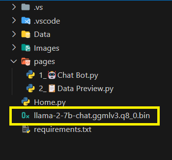

# Chat-Bot-csv-xlsx-Reader
Chat Bot reads the uploaded csv are xlsx file and answers the quetions related to uploaded file.

## Python 3 
Download the python latest version 3 and create a virtual environment using the below command.

Follow the below steps:
### Step-1: `conda create -n venv python==3.10`
This will create a virtual environment with python version of 3.10

### Step-2: `pip install -r requirements.txt`
It will Install all the requirements

### Step-3: `Model Download`
Download the model using the below link and place it in the project directory as shown in the screenshot below.
[Model Link] (https://huggingface.co/TheBloke/Llama-2-7B-Chat-GGML/blob/main/llama-2-7b-chat.ggmlv3.q8_0.bin)

### Step-4: `stremlit run Home.py`
Thsi will start the application and take you to the default browser once after running the command.

Below you can see chat bot Tab and upload the csv are xlsx file and start the convertion with the chat bot and can also preview the data in the Data Preview Tab.

